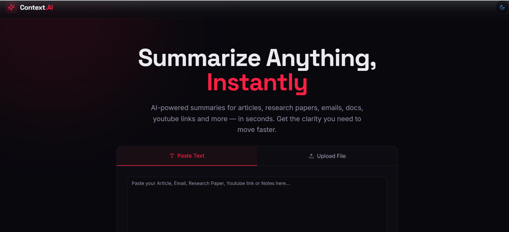
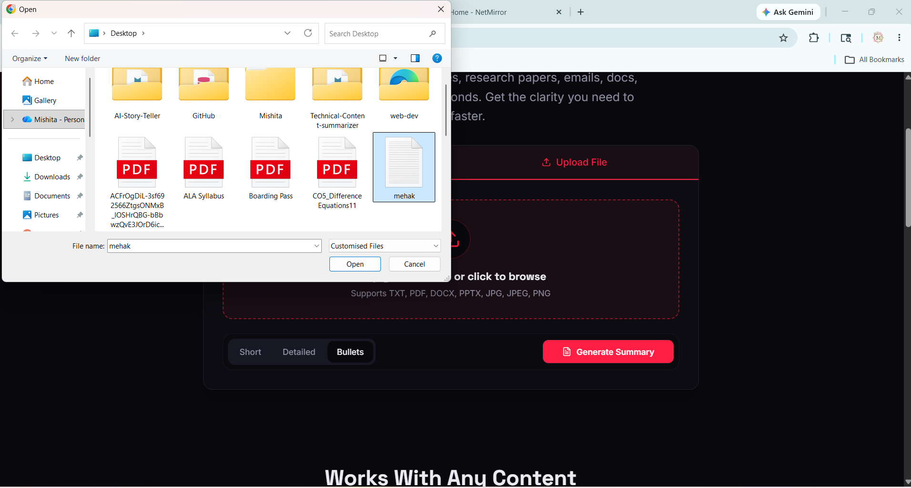
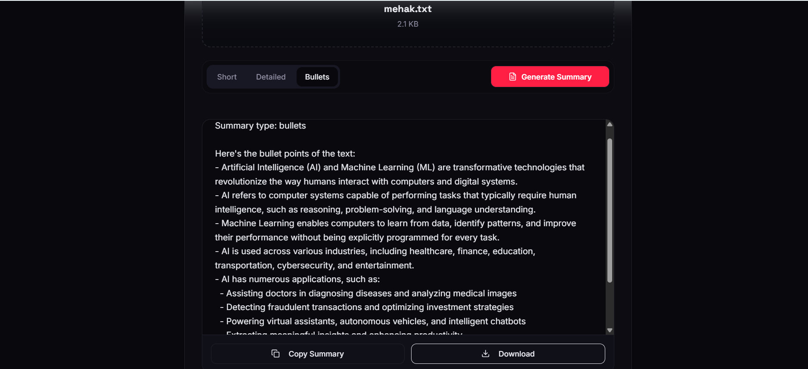
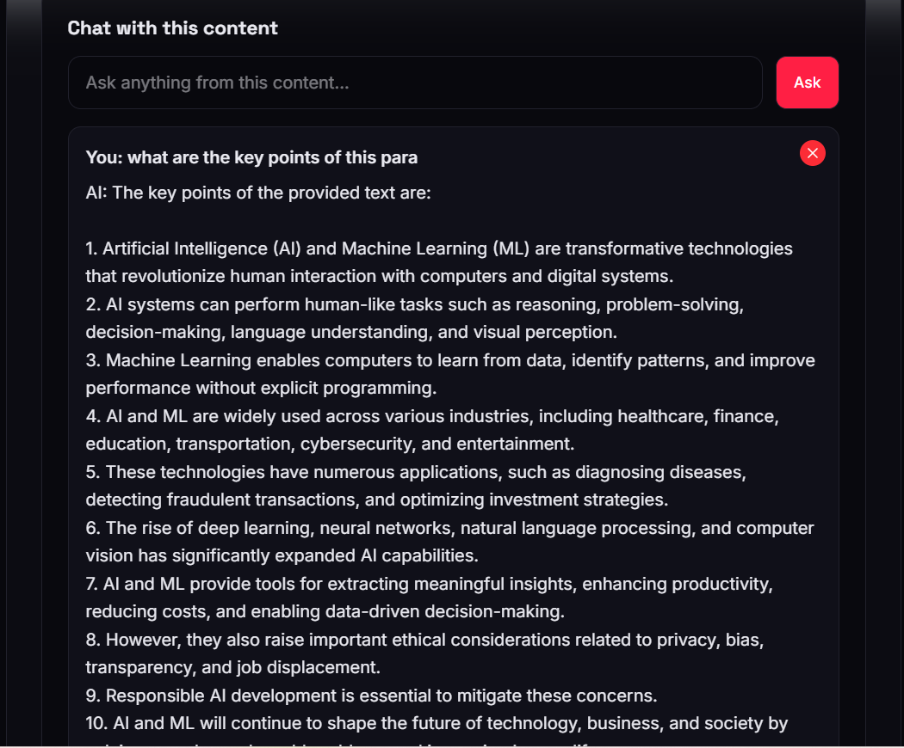

# Context AI – Technical Content Summarizer & Document Assistant

  

## Overview

Context AI is an AI-powered document intelligence platform that enables users to upload PDFs, text files, and images, generate intelligent summaries, and interact with documents through context-aware conversations. By leveraging Gorq AI, the platform helps users quickly extract insights, understand complex technical content, and obtain accurate answers directly from uploaded documents.

Whether analyzing research papers, technical documentation, study materials, or reports, Context AI transforms lengthy content into actionable knowledge through AI-powered summarization and document chat.
---
# 📸 Screenshots

### Home Page

### Document Upload

### AI Summary Generation

### Document Chat

## Features

* Upload PDF, TXT, JPG, JPEG, PNG files and Youtube Links as well.
* AI-powered technical content analysis
* Multiple summary formats:

  * Short Summary
  * Detailed Summary
  * Bullet Point Summary
* Chat with uploaded documents
* Ask questions about document content
* Fast and responsive user experience
* Modern and user-friendly interface
* Full-stack deployment

---

## Tech Stack

### Frontend

* React.js
* TypeScript
* Vite
* Tailwind CSS
* Axios

### Backend

* Node.js
* Express.js
* Multer

### AI

* Gorq API

### Deployment

* Vercel (Frontend)
* Render (Backend)

---

## How It Works

1. Upload a document or image.
2. Content is extracted from the uploaded file.
3. Gemini AI analyzes the content.
4. Users can:

   * Generate summaries
   * View key information
   * Chat with the document
   * Ask context-aware questions
5. Results are displayed instantly through the web interface.

---

## Use Cases

* Research Paper Analysis
* Technical Documentation Review
* Study Notes Generation
* Knowledge Extraction
* Academic Learning
* Developer Documentation Understanding

---

## Challenges Faced

* Processing multiple file formats efficiently
* Managing large document inputs for AI processing
* Maintaining conversation context during document chat
* Handling frontend-backend communication
* Deployment and API integration

---

## What I Learned

* Full-Stack Web Development
* AI API Integration
* File Upload & Processing
* REST API Development
* React & TypeScript
* Backend Deployment
* Error Handling & Debugging
* Building Real-World AI Applications

## Author

**Mishita Tiwari**

GitHub: https://github.com/mishita27twr

If you found this project interesting, consider giving it a star on GitHub.
